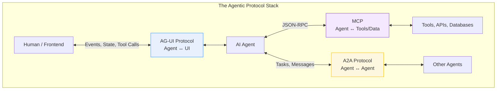
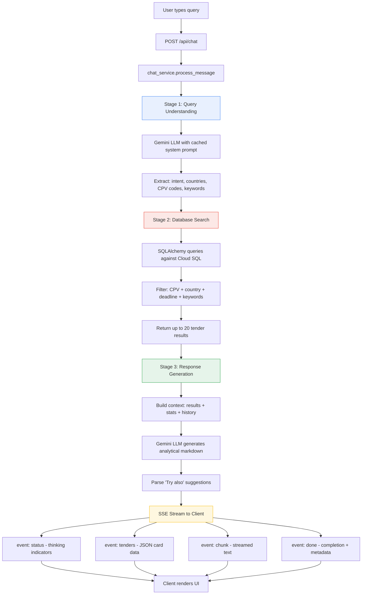
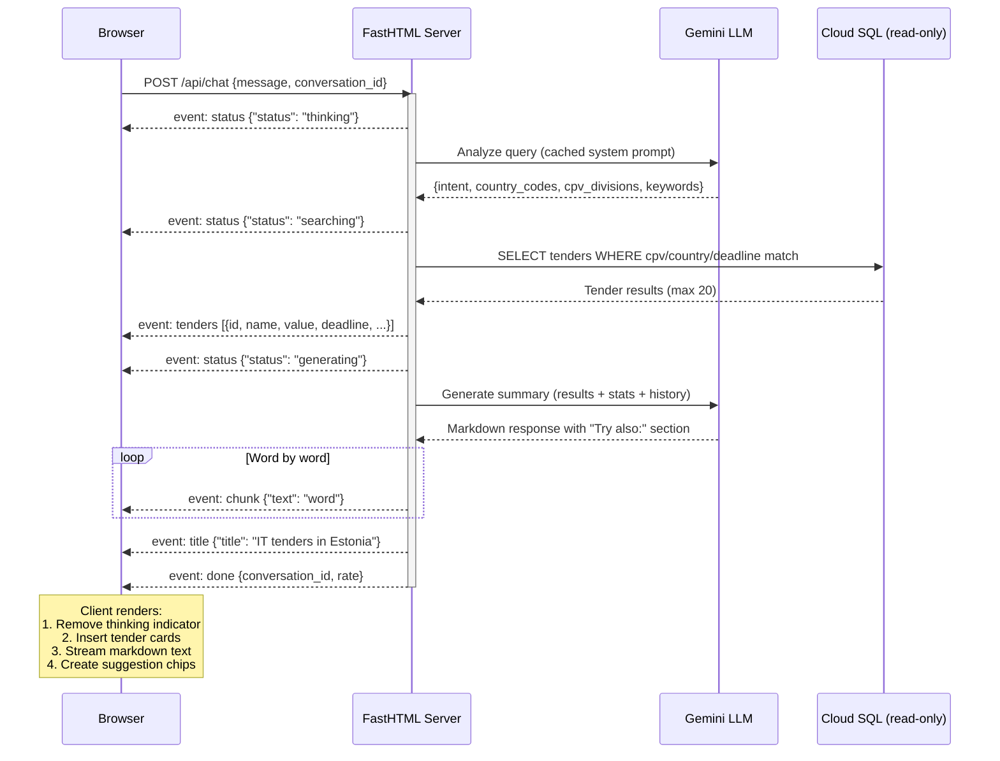
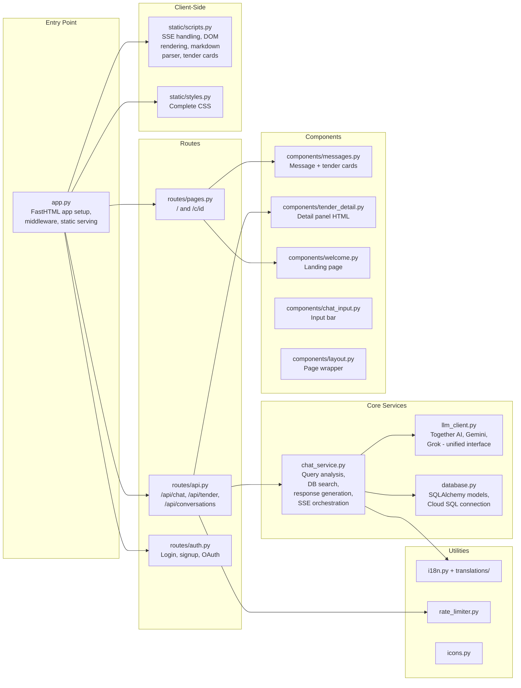
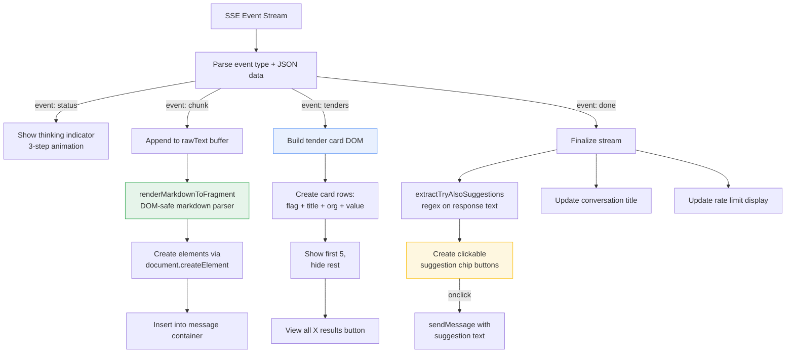
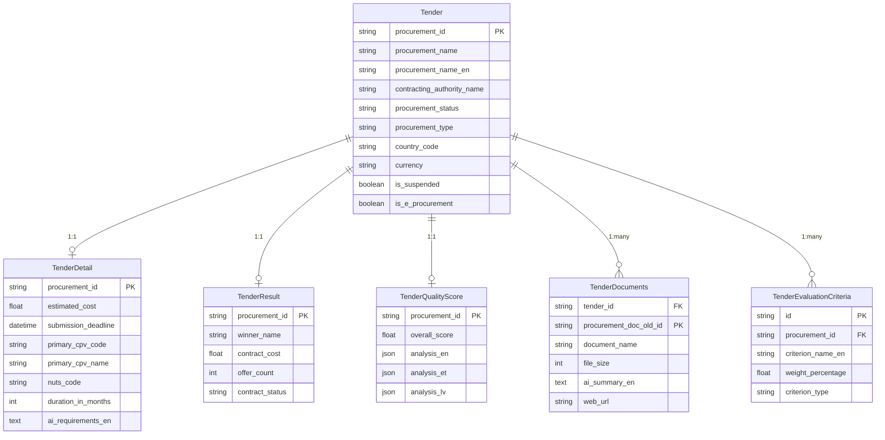
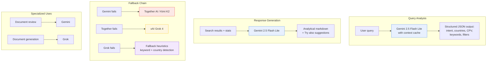
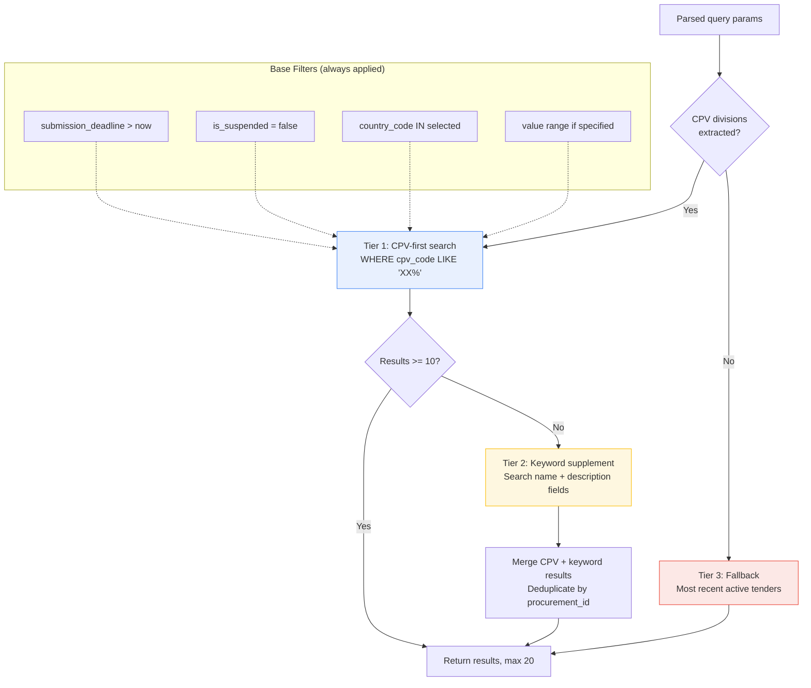

# Tendly Agent Chat - Architecture

## Overview

Tendly Agent Chat is an AI-powered procurement intelligence interface that implements **generative UI** patterns -- the LLM doesn't just return text, it drives the entire UI experience: structured tender cards, contextual suggestions, detail panels, and analytical summaries are all generated dynamically based on each user query.

---

## How It Implements Generative UI / AG-UI Patterns

### What is Generative UI?

Generative UI (also called Agent UI or AG-UI) is a pattern where AI agents produce **structured UI components** alongside natural language, rather than plain text alone. Instead of the user reading a wall of text and manually looking up tenders, the agent:

1. **Understands intent** -- extracts structured parameters from natural language
2. **Retrieves data** -- executes targeted database queries
3. **Renders rich components** -- tender cards, quality badges, detail panels
4. **Suggests next actions** -- "Try also:" chips guide exploration

### Generative UI Elements in This Project

| Pattern | Implementation | How It Works |
|---------|---------------|--------------|
| **Structured data cards** | `event: tenders` SSE event | LLM extracts search params, DB returns results, client renders interactive cards |
| **Progressive disclosure** | Show 5 / "View all" | AI returns full result set; UI reveals progressively |
| **Contextual suggestions** | "Try also:" chips | LLM generates follow-up queries; client parses them into clickable buttons |
| **Detail panel on demand** | `/api/tender/{id}` | Server renders HTML fragment; client inserts as overlay |
| **Thinking indicators** | `event: status` | Multi-step progress (understanding -> searching -> analyzing) |
| **Streamed narrative** | `event: chunk` | Word-by-word rendering of analytical markdown |
| **Dynamic conversation titles** | `event: title` | LLM generates title from first message context |

### Comparison with AG-UI Standard

The [AG-UI protocol](https://docs.ag-ui.com) defines a standard for agent-to-frontend communication. Here's how Tendly Agent Chat maps to it:

| AG-UI Concept | Tendly Implementation | Gap |
|--------------|----------------------|-----|
| **Event stream** | SSE with typed events (`status`, `chunk`, `tenders`, `done`) | Custom event names vs AG-UI's `TEXT_MESSAGE_CONTENT`, `STATE_DELTA`, etc. |
| **Tool call results as UI** | Tender cards rendered from structured JSON | Not framed as "tool calls" -- the search is implicit in the pipeline |
| **State management** | Conversation history in DB + client-side `rawText` buffer | No formal shared state object between agent and UI |
| **Lifecycle events** | `status` (thinking/searching/generating) -> `done` | Maps roughly to AG-UI's `RUN_STARTED`, `STEP_STARTED`, `RUN_FINISHED` |
| **Custom events** | `tenders`, `title`, `rate_limit` | AG-UI supports custom events; these would be natural extensions |

---

## Agent-UI Protocol Landscape

Six protocols/SDKs address different layers of the AI agent stack. They are **complementary**, not competing -- each solves a different problem.



### Protocol Comparison

| | AG-UI | Vercel AI SDK | LangGraph Streaming | OpenAI Responses API | MCP | A2A |
|---|---|---|---|---|---|---|
| **Creator** | CopilotKit | Vercel | LangChain | OpenAI | Anthropic | Google |
| **Layer** | Agent-to-UI | Agent-to-UI | Agent framework | LLM API | Agent-to-Tools | Agent-to-Agent |
| **Transport** | SSE + Protobuf | SSE | In-process + Cloud SSE | SSE | Stdio + HTTP | JSON-RPC / gRPC / REST |
| **Event types** | ~30 typed | ~15 stream parts | 7 streaming modes | ~20+ events | JSON-RPC methods | Task status/artifact |
| **Shared state** | Yes (snapshot + JSON Patch) | No | Yes (graph state) | No | No | No (opaque agents) |
| **Tool calls** | Full lifecycle | Delta-based | Via @tool decorator | function_call delta | tools/call (JSON-RPC) | Via task messages |
| **Bidirectional** | Yes | Limited | Yes (within graph) | No | Yes | Yes |
| **Human-in-the-loop** | First-class | Via hooks | Via interrupts | No | Via elicitation | Via input_required |
| **Generative UI** | Yes (activity + tools) | Yes (useChat) | No | No | MCP Apps (new) | No |
| **Language SDKs** | TS, Python, Go, Kotlin, Java, Rust, Dart, Ruby | TS only | Python, JS | All (HTTP) | TS, Python, Java, C#, Go, Kotlin | Python, Go, JS, Java, .NET |
| **Framework lock-in** | No (protocol standard) | Vercel/React | LangChain ecosystem | OpenAI-only | No (protocol standard) | No (protocol standard) |

### Pros and Cons for Tendly Agent Chat

| Standard | Pros | Cons | Fit for Tendly |
|----------|------|------|----------------|
| **AG-UI** | Open protocol, ~30 typed events cover our full pipeline, bidirectional shared state would enable real-time filters, explicit tool call events would make search transparent, framework-agnostic, Python SDK available, growing ecosystem (12k+ GitHub stars) | Still young (May 2025), primary client is CopilotKit (React) -- no FastHTML adapter, would need custom client-side implementation, adds protocol overhead for a single-agent app | **High fit** -- best match for standardizing our SSE events and making the pipeline transparent. Adoption path: map our 6 custom events to AG-UI's ~10 equivalents. |
| **Vercel AI SDK** | Excellent React DX with `useChat`/`useCompletion` hooks, built-in streaming text rendering, tool execution, structured output, large community | TypeScript/React only -- incompatible with FastHTML/HTMX stack, Vercel ecosystem lock-in, no shared state concept, no Python SDK | **Low fit** -- wrong stack. Would require rewriting the frontend in React. |
| **LangGraph Streaming** | Deep agent workflow support, state graph with checkpoints and branching, human-in-the-loop via interrupts, natural fit for multi-step procurement analysis | Not a wire protocol (in-process Python), requires adopting LangGraph as framework, Cloud SSE is proprietary, no standardized frontend event format | **Medium fit** -- valuable if we add multi-agent workflows (e.g., parallel country search + comparison). Overkill for current single-pipeline architecture. |
| **OpenAI Responses API** | Mature streaming format, rich tool/function calling, built-in file search and code interpreter, wide adoption | OpenAI-proprietary, only works with OpenAI models (we use Gemini/Together/Grok), no shared state, no bidirectional communication, vendor lock-in | **Low fit** -- wrong LLM provider. Would limit us to OpenAI models. |
| **MCP** | Standardizes tool/resource access, "USB-C for AI", open protocol by Anthropic, growing ecosystem, would let external agents query our tender DB | Not an agent-to-UI protocol, doesn't help with streaming chat or rendering, JSON-RPC is request/response (not streaming), adds complexity for internal tools | **Medium fit** -- complementary, not replacement. Could expose our tender search as an MCP tool for other agents to consume. Not relevant for the chat UI layer. |
| **A2A** | Standard for multi-agent orchestration, agent cards for capability discovery, async task lifecycle, push notifications | Not agent-to-UI, overkill for single-agent system, adds protocol overhead, no frontend rendering concerns | **Low fit** -- relevant only if Tendly becomes a multi-agent platform where specialized agents (country experts, document analysts) collaborate. |

### Recommended Adoption Path

```mermaid
graph LR
    subgraph "Phase 1: Event Standardization"
        E1[Map SSE events to<br/>AG-UI event types]
        E2[Add tool call events<br/>for search transparency]
    end

    subgraph "Phase 2: State Management"
        S1[Implement shared state<br/>object for filters/results]
        S2[Add STATE_DELTA events<br/>for real-time filter updates]
    end

    subgraph "Phase 3: Ecosystem Integration"
        I1[Expose tender search<br/>as MCP tool]
        I2[Consider LangGraph for<br/>multi-agent workflows]
        I3[Evaluate A2A if building<br/>multi-agent platform]
    end

    E1 --> E2 --> S1 --> S2 --> I1 --> I2 --> I3

    style E1 fill:#e8f0fe,stroke:#4285f4
    style E2 fill:#e8f0fe,stroke:#4285f4
    style S1 fill:#e6f4ea,stroke:#34a853
    style S2 fill:#e6f4ea,stroke:#34a853
    style I1 fill:#f3e8fd,stroke:#7c3aed
    style I2 fill:#fef7e0,stroke:#fbbc04
    style I3 fill:#fef7e0,stroke:#fbbc04
```



### AG-UI Event Mapping (Phase 1)

How current Tendly events would map to AG-UI:

| Current Tendly Event | AG-UI Equivalent | Notes |
|---------------------|-----------------|-------|
| `event: status {"status":"thinking"}` | `RUN_STARTED` + `STEP_STARTED {stepName: "query_analysis"}` | Explicit lifecycle |
| `event: status {"status":"searching"}` | `STEP_STARTED {stepName: "tender_search"}` + `TOOL_CALL_START {toolCallName: "search_tenders"}` | Makes search visible as a tool call |
| `event: tenders [...]` | `TOOL_CALL_END` + `STATE_DELTA` (add tenders to shared state) | Results become part of shared state |
| `event: status {"status":"generating"}` | `STEP_STARTED {stepName: "response_generation"}` | Explicit step boundary |
| `event: chunk {"text":"..."}` | `TEXT_MESSAGE_CONTENT {delta: "..."}` | Direct mapping |
| `event: title {"title":"..."}` | `STATE_DELTA {op: "replace", path: "/title"}` | Metadata as state update |
| `event: done {...}` | `RUN_FINISHED {result: {...}}` | Direct mapping |
| `event: error {...}` | `RUN_ERROR {message: "..."}` | Direct mapping |
| `event: rate_limit {...}` | `CUSTOM {name: "rate_limit", value: {...}}` | Application-specific extension |

---

## Architecture

### High-Level Data Flow



### SSE Event Protocol



### File Structure & Responsibilities



### Client-Side Rendering Pipeline



### Database Schema (Read-Only)



### LLM Provider Strategy



### Three-Tier Search Strategy



---

## Suggestions for Improvement

### 1. Adopt AG-UI Protocol for Event Naming

The current SSE events use custom names (`chunk`, `tenders`, `status`). Adopting [AG-UI's event taxonomy](https://docs.ag-ui.com) would improve interoperability:

| Current | AG-UI Equivalent | Benefit |
|---------|-----------------|---------|
| `event: status` | `STEP_STARTED` / `STEP_FINISHED` | Standard lifecycle tracking |
| `event: chunk` | `TEXT_MESSAGE_CONTENT` | Compatible with AG-UI clients |
| `event: tenders` | `STATE_DELTA` or `CUSTOM` | Structured state updates |
| `event: done` | `RUN_FINISHED` | Standard completion signal |

This doesn't require rewriting the backend -- add an adapter layer that translates internal events to AG-UI format.

### 2. Expose Search as an Explicit Tool Call

Currently the search is an implicit step inside `process_message()`. Modeling it as a **tool call** (AG-UI style) would:

- Let the client show "Calling: search_tenders(country=EE, cpv=72)" in the UI
- Enable future multi-tool flows (e.g., search + compare + summarize)
- Align with how other agent frameworks (LangChain, OpenAI) structure actions

```
event: TOOL_CALL_START
data: {"tool": "search_tenders", "args": {"country": "EE", "cpv": ["72"]}}

event: TOOL_CALL_END
data: {"tool": "search_tenders", "result_count": 15}
```

### 3. Add Client-Side State Management

The client currently manages state via scattered variables (`rawText`, `currentConversationId`, `pendingEventType`). A lightweight state object would make the streaming pipeline more predictable:

```javascript
const chatState = {
  conversationId: null,
  isStreaming: false,
  rawText: '',
  tenders: [],
  suggestions: [],
  rateLimit: { remaining: 0, limit: 0 }
};
```

This maps to AG-UI's concept of **shared state** between agent and UI.

### 4. Implement Structured Tool Results for Tender Detail

The detail panel fetches server-rendered HTML (`/api/tender/{id}`). An alternative generative UI approach: return structured JSON and let the client render it, matching how tender cards already work. Benefits:

- Consistent rendering pipeline (all dynamic content via JSON -> DOM)
- Easier to add client-side interactivity (save, compare, share)
- Better for future mobile/native clients

### 5. Add Streaming for Response Generation

Currently the backend generates the full response, then the route chunks it word-by-word for a streaming visual effect (`routes/api.py:76-80`). True LLM streaming would:

- Reduce time-to-first-token
- Show genuine incremental generation
- Improve perceived responsiveness

```python
# Instead of: response = await llm.chat_completion_async(...)
# Use: async for chunk in llm.stream_completion_async(...):
#          yield f"event: chunk\ndata: {json.dumps({'text': chunk})}\n\n"
```

### 6. Add Error Recovery in the SSE Stream

If the LLM fails mid-stream, the client may hang. Add:

- **Timeout handling** -- client-side watchdog that detects stalled streams
- **Retry with fallback** -- if Gemini fails, retry with Together AI, transparently
- **Partial result delivery** -- if response generation fails but search succeeded, still show tender cards with a "Could not generate summary" note

### 7. Add Conversation Branching

Currently conversations are linear. Allow users to re-ask a question with different parameters (e.g., "same but in Latvia") by branching from a previous message. This is a natural AG-UI extension.

### 8. Cache Search Results Client-Side

Tender card data received via SSE is rendered and discarded. Caching it in `chatState.tenders` would enable:

- Instant detail panel pre-population (no server round-trip for basic info)
- Client-side filtering/sorting of results
- Comparison views between tenders

### 9. Extract CSS/JS into Separate Files

`static/styles.py` (~800 lines of CSS) and `static/scripts.py` (~1200 lines of JS) are Python strings. Moving them to actual `.css` and `.js` files would enable:

- IDE syntax highlighting and linting
- Browser caching with content hashes
- Easier debugging with source maps

### 10. Add Observability to the Agent Pipeline

Track and expose metrics for each stage:

- Query analysis latency + cache hit rate
- Search query time + result count
- Response generation latency + token usage
- End-to-end time per conversation turn

This could feed into a simple `/api/health` or `/api/metrics` endpoint, useful for monitoring the agent's effectiveness over time.
