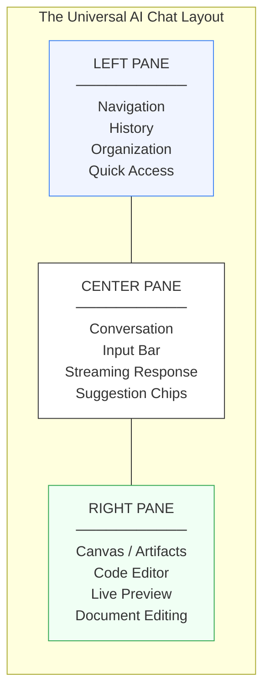
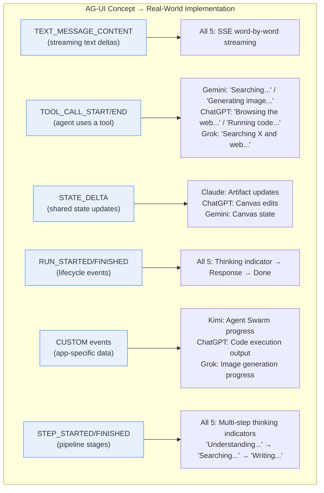
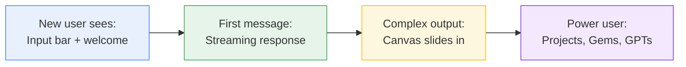

# AI Chat UX Comparison: Why They're 90% the Same

## The Convergent Design

ChatGPT, Claude.ai, Grok, Google Gemini, and Kimi have independently converged on nearly identical UX patterns. This is not coincidence -- it's the result of solving the same fundamental problem: **how do you let a human have a productive conversation with an AI agent?**

The answer, across all five, is a three-zone layout with SSE streaming, progressive disclosure, and generative UI panels that appear on demand.

---

## The Shared Blueprint: Left / Center / Right

Every major AI chat tool follows the same spatial grammar:



### Left Pane: Navigation & Memory

The left pane answers: **"Where have I been, and where can I go?"**

| Feature | ChatGPT | Claude.ai | Grok | Gemini | Kimi |
|---------|---------|-----------|------|--------|------|
| Conversation history | Scrollable list | Scrollable list | Scrollable list | Scrollable list | Scrollable list |
| Search/filter chats | Yes | Yes | Yes | Yes | Yes |
| Pin conversations | Yes | Star | Yes | Pin | No |
| New chat button | Top of sidebar | Top of sidebar | Top of sidebar | Top of sidebar | Top of sidebar |
| Collapsible | Yes (icon-only mode) | Yes | Yes (icon-only) | Hamburger toggle | Yes |
| Organization unit | GPTs / Projects | Projects | Workspaces | Gems | Tool categories |
| Settings | Bottom of sidebar | Bottom of sidebar | In sidebar | Bottom of sidebar | Bottom of sidebar |
| Unique elements | "Explore GPTs" store, Deep Research, Images, Apps, Health | Projects with knowledge bases | Tasks, Workspaces | Pinned Gems | Kimi Code, Kimi Claw, Agent Swarm |

**Why this works:** The left pane is a **temporal navigation system**. Users build up dozens to hundreds of conversations over weeks. Without searchable, organized history, the tool becomes a single-session disposable. Every tool learned this from messaging apps (Slack, iMessage, WhatsApp) where the left rail is always the thread list.

### Center Pane: The Conversation

The center pane answers: **"What is the AI saying to me right now?"**

| Feature | ChatGPT | Claude.ai | Grok | Gemini | Kimi |
|---------|---------|-----------|------|--------|------|
| Message bubbles | User / ChatGPT labels | User / Claude labels | User / Grok labels | User / Gemini labels | User / Kimi labels |
| Model selector | Top bar (Auto/Fast/Thinking) | Top bar (Opus/Sonnet/Haiku) | Mode toggles | Prompt bar dropdown | Prompt bar (Instant/Thinking/Agent) |
| Input area position | Bottom, full-width | Bottom, full-width | Bottom, full-width | Bottom, full-width | Bottom, full-width |
| File upload | Attachment button + drag | Attachment + drag | Attachment | Files + Drive + Photos | Attachment |
| Voice input | Yes (Voice button) | No | Yes | Yes (dictate) | No |
| Streaming text | Word-by-word SSE | Word-by-word SSE | Word-by-word SSE | Word-by-word SSE | Word-by-word SSE |
| Markdown rendering | Full (code, tables, lists) | Full + outline nav | Full | Full | Full |
| Suggestion chips | Quick actions below input | Suggested followups | Quick actions | Quick action chips | Tool category chips |
| Thinking indicators | Animated dots | "Thinking..." with steps | Animated | Animated sparkle | Animated |
| Copy/retry/edit | All three | All three | All three | All three | All three |

**Why this works:** The center pane is an **infinite scroll conversation** -- the same mental model as every messaging app built since 2010. Input at the bottom (where thumbs are on mobile, where eyes rest on desktop). The AI's response streams in real-time to maintain engagement. Every tool uses SSE for this because WebSockets are overkill for unidirectional text streaming.

### Right Pane: The Canvas / Artifacts / Studio

The right pane answers: **"What did the AI create, and how can I refine it?"**

| Feature | ChatGPT (Canvas) | Claude.ai (Artifacts) | Grok (Studio) | Gemini (Canvas) | Kimi |
|---------|-------------------|----------------------|----------------|-----------------|------|
| **Trigger** | Auto when >10 lines | Auto-detect content type | User/auto | Tool menu or auto | Tool outputs (Docs/Slides/Sheets) |
| **Activation** | Slides open from right | Slides open from right | Slides open from right | Slides open from right | Opens as new view |
| **Code editing** | Full editor + shortcuts | Code view + targeted edits | Code-prominent + live preview | Code view + preview + console | Via Kimi Code CLI |
| **Live preview** | Limited | React, HTML, SVG, Mermaid | Built-in preview pane | Preview + console | Websites output |
| **Document editing** | Rich text editing | Markdown + downloadable docs | Docs + reports | Rich text + formatting | Docs, Slides, Sheets |
| **Highlight & edit** | Select text, ask for changes | Select section, request edits | Direct code editing | Highlight for rewrites | Region editing |
| **Supported formats** | Code, docs | Code, SVG, React, HTML, Mermaid, .docx/.pptx | Code, HTML, games, docs | Code, apps, games, infographics, quizzes | Websites, Docs, Slides, Sheets |
| **Persistence** | Per conversation | Per conversation, embeddable | Per conversation | Persists across sessions | Per conversation |

**Why this works:** The right pane solves the biggest limitation of chat: **text is a terrible medium for structured output**. Code needs syntax highlighting and editing. Documents need formatting. Apps need live preview. Rather than cramming these into chat bubbles, every tool independently arrived at a split-screen pattern where conversation stays left and creation happens right.

---

## The 90% Similarity: What They All Share

```mermaid
graph TD
    subgraph "Shared DNA (90%)"
        A[Three-zone layout<br/>Left + Center + Right]
        B[SSE streaming<br/>word-by-word response]
        C[Collapsible left sidebar<br/>with conversation history]
        D[Bottom-anchored input bar<br/>with attachments]
        E[Model/mode selector<br/>in top bar or input]
        F[Markdown rendering<br/>with code blocks]
        G[Canvas/Artifacts panel<br/>slides in from right]
        H[Copy / Retry / Edit<br/>action buttons on messages]
        I[Thinking/loading indicators<br/>during generation]
        J[Suggestion chips<br/>for next actions]
    end

    subgraph "Differentiators (10%)"
        D1[ChatGPT: GPT Store,<br/>Apps SDK, Codex]
        D2[Claude: Projects with<br/>knowledge bases, embeddable artifacts]
        D3[Grok: X/Twitter integration,<br/>image+video generation]
        D4[Gemini: Google ecosystem<br/>Gmail/Drive/Chrome sidebar]
        D5[Kimi: Agent Swarm,<br/>256K context, CLI tools]
    end

    A --> D1
    A --> D2
    A --> D3
    A --> D4
    A --> D5

    style A fill:#e8f0fe,stroke:#4285f4
    style B fill:#e8f0fe,stroke:#4285f4
    style C fill:#e8f0fe,stroke:#4285f4
    style D fill:#e8f0fe,stroke:#4285f4
    style E fill:#e8f0fe,stroke:#4285f4
    style F fill:#e8f0fe,stroke:#4285f4
    style G fill:#e8f0fe,stroke:#4285f4
    style H fill:#e8f0fe,stroke:#4285f4
    style I fill:#e8f0fe,stroke:#4285f4
    style J fill:#e8f0fe,stroke:#4285f4
```



### The 10 Universal Patterns

1. **Three-zone spatial layout** -- Left for navigation, center for conversation, right for creation. Not a single tool deviates from this.

2. **SSE streaming** -- All five stream responses word-by-word over Server-Sent Events. None use WebSockets for the primary chat flow. SSE is simpler, works through proxies/CDNs, and is inherently unidirectional (which is all you need for "AI talks, human listens").

3. **Collapsible sidebar** -- Every tool lets users collapse the left pane to maximize conversation space. ChatGPT and Grok support icon-only mode; Gemini uses a hamburger toggle; Claude and Kimi fully hide it.

4. **Bottom-anchored input** -- The text input is always at the bottom of the center pane, full-width, with attachment and submit buttons. This mirrors every messaging app and keeps the input in the user's peripheral vision while reading.

5. **Model/mode selector** -- All five let users switch between model tiers (fast/balanced/powerful) or modes (chat/think/research). Placement varies: top bar (ChatGPT, Claude) or inside the input area (Gemini, Kimi).

6. **Markdown rendering** -- All render response text as rich markdown: headers, bold/italic, code blocks with syntax highlighting, tables, and lists. Code blocks always have a "Copy" button.

7. **Canvas/Artifacts right panel** -- When the AI generates substantial structured content (code, documents, apps), a panel slides in from the right. The conversation stays on the left for refinement instructions. This is the core generative UI pattern.

8. **Message action buttons** -- Every tool shows Copy, Retry (regenerate), and Edit (modify prompt) buttons on each message. These are the minimum viable actions for iterating on AI output.

9. **Thinking indicators** -- All show animated indicators while the AI processes. Some show multi-step progress (ChatGPT, Claude); others show a simple animation (Gemini sparkle, Grok dots).

10. **Suggestion chips** -- All offer quick-action buttons below the input or within responses to guide the user's next query. These reduce the cognitive load of figuring out "what to ask next."

---

## How They Use AG-UI Patterns (Implicitly)

None of these tools formally implement the AG-UI protocol (which was open-sourced in May 2025 by CopilotKit). However, they all implement the same **concepts** that AG-UI codifies:



### SSE Event Format Comparison

| Tool | SSE Format | Event Types | Special Features |
|------|-----------|-------------|-----------------|
| **ChatGPT** | `data: {JSON}\n\n` | Single `data` line per chunk, `[DONE]` terminator | Tool use events for browsing, code execution, DALL-E |
| **Claude.ai** | Typed SSE events | `message_start`, `content_block_start`, `content_block_delta`, `content_block_stop`, `message_delta`, `message_stop` | Most structured protocol; explicit block-level granularity |
| **Grok** | Standard SSE | `data: {JSON}\n\n` chunks | Web + X search result events |
| **Gemini** | Proprietary (normalized via routers) | Custom protocol, chunk-based | Deeply integrated with Google service events |
| **Kimi** | OpenAI-compatible SSE | `data: {JSON}\n\n` (OpenAI format) | Agent Swarm parallel execution events |
| **AG-UI standard** | SSE + Protobuf | ~30 typed events (RUN_STARTED, TEXT_MESSAGE_CONTENT, TOOL_CALL_*, STATE_DELTA, etc.) | Most comprehensive; bidirectional state, tool lifecycle |

**Key insight:** Claude.ai's SSE format is the closest to AG-UI's typed event model. ChatGPT and Kimi use simpler single-line JSON. All of them would benefit from AG-UI's explicit tool call lifecycle events to make agent actions more transparent to the UI.

---

## The 10% Differentiation: What Makes Each Unique

### ChatGPT: The App Platform

```
Unique: GPT Store (marketplace of custom agents)
        Apps SDK (third-party widgets inside chat)
        Codex (autonomous coding agent)
        Advanced Data Analysis (Python sandbox)
        Memory (persistent cross-session context)
        DALL-E / GPT Image generation
```

**Design choice:** ChatGPT positioned itself as a **platform**, not just a chat tool. The GPT Store and Apps SDK turn it into an app marketplace where third parties build on top of the chat interface. Canvas auto-triggers when content exceeds 10 lines, lowering the barrier to enter the editing mode.

**Why high adoption:** First-mover advantage (Nov 2022), brand recognition, and the GPT Store creates network effects -- users come for the custom GPTs, creators build for the audience.

### Claude.ai: The Knowledge Worker's Tool

```
Unique: Projects (workspace with persistent knowledge base)
        Artifacts (embeddable, shareable, downloadable)
        200K token context (largest standard window)
        Outline navigation for long responses
        Tone/Length controls on responses
```

**Design choice:** Claude optimized for **depth over breadth**. Projects let users upload entire codebases or document sets as persistent context. Artifacts are the most versatile right-panel implementation -- they support React apps, SVG, Mermaid diagrams, and downloadable office documents. The embeddable artifacts feature (June 2025) lets users publish AI-created apps as standalone web pages.

**Why high adoption:** Best-in-class for long-form work (writing, coding, analysis). Projects with knowledge bases are unmatched for professional workflows. The Artifacts panel is the most polished canvas implementation.

### Grok: The Real-Time Intelligence Hub

```
Unique: X (Twitter) real-time data integration
        Imagine (image + video generation)
        Fun Mode (personality toggle)
        DeepSearch / DeeperSearch (live web crawling)
        Google Drive integration in Studio
```

**Design choice:** Grok differentiates through **real-time data access**. While other tools search the web, Grok has native access to X's firehose of real-time posts and trends. Studio deliberately gives "more prominence to the code than the prompt" -- the code editor is larger than the chat, inverting Claude's 50/50 split.

**Why high adoption:** Built-in to X (Twitter) with 500M+ monthly users. No separate signup needed for X users. Real-time data access makes it uniquely useful for news, trends, and social analysis.

### Google Gemini: The Ecosystem Integrator

```
Unique: Gmail/Drive/Docs/Sheets/Chrome sidebar integration
        Gems (reusable custom assistants)
        NotebookLM integration
        Deep Research with personal source search
        1M token context (Gemini 3)
        "Vibe coding" for building shareable apps
```

**Design choice:** Gemini's strategy is **ecosystem leverage**. It appears everywhere Google already is: as a sidebar in Gmail, a helper in Docs, a panel in Chrome, a feature in Photos. The Canvas supports the widest variety of output types (code, games, infographics, quizzes, audio summaries). Gems are lighter than GPTs -- no marketplace, just personal reusable presets.

**Why high adoption:** 2B+ Google account holders get Gemini integrated into tools they already use daily. The Chrome sidebar ("Glic") means Gemini is available on every webpage without switching tabs.

### Kimi: The Agent Powerhouse

```
Unique: Agent Swarm (100 parallel sub-agents)
        256K context window (K2.5)
        Kimi Code (CLI tool)
        Kimi Claw (bot builder)
        Design-to-code (screenshot to components)
        1,500 parallel tool calls
```

**Design choice:** Kimi differentiates through **scale and parallelism**. While other tools run one agent at a time, Agent Swarm orchestrates up to 100 sub-agents working simultaneously on different parts of a complex task. The 256K context and 100 tok/s output speed target power users who process large documents. Tool category chips (Websites, Docs, Slides, Sheets) below the input make generative capabilities immediately discoverable.

**Why high adoption:** Dominant in China's market, expanding globally. Aggressive free tier, fastest output speed, and Agent Swarm is a genuine capability differentiator for complex research tasks.

---

## Why These Design Choices Drive Adoption

### 1. Zero Learning Curve

Every tool looks like a messaging app. Users already know how to:
- Type at the bottom
- Read responses scrolling up
- Click on threads in a sidebar
- Copy, retry, or edit messages

**The 90% shared design is intentional.** It means users can switch between tools without relearning the interface.

### 2. Progressive Disclosure



All five tools start with a nearly empty screen: a big prompt and a friendly greeting. Complexity reveals itself only as needed:
- Sidebar shows after first conversation
- Canvas/Artifacts appear only when content warrants it
- Advanced features (Projects, Gems, Agent Swarm) live in secondary navigation

This prevents overwhelming new users while giving power users full access.

### 3. Streaming Creates Engagement

Word-by-word streaming (via SSE) serves a critical psychological function: **it proves the AI is working**. A 10-second wait with a spinner feels broken. A 10-second stream of appearing text feels responsive and engaging. Users read along as the response forms, creating a sense of collaboration rather than request/response.

### 4. The Canvas Solves Chat's Limitation

Chat is linear and temporal -- great for conversation, terrible for iteration. When you need to refine code or edit a document, scrolling through a thread to find the latest version is painful. The right panel (Canvas/Artifacts/Studio) gives structured output a **persistent, editable home** while keeping the conversation channel open for instructions.

### 5. Conversation History as Memory

The left sidebar serves as the AI's "memory" -- users can return to previous threads and continue where they left off. This transforms the tool from a single-use query box into a persistent workspace. Every tool groups, pins, searches, and organizes conversations because users need this to build long-term workflows.

---

## Comparison Matrix: Full Feature Breakdown

| Category | Feature | ChatGPT | Claude.ai | Grok | Gemini | Kimi |
|----------|---------|:-------:|:---------:|:----:|:------:|:----:|
| **Layout** | Left sidebar | Yes | Yes | Yes | Yes (hamburger) | Yes |
| | Center chat | Yes | Yes | Yes | Yes | Yes |
| | Right canvas | Canvas | Artifacts | Studio | Canvas | Tool outputs |
| | Responsive/mobile | Yes | Yes | Yes | Yes | Yes |
| **Streaming** | SSE protocol | Yes | Yes (typed) | Yes | Proprietary | Yes (OpenAI-compat) |
| | Word-by-word | Yes | Yes | Yes | Yes | Yes |
| | Thinking steps | Yes | Yes | Yes | Yes | Yes |
| **Input** | Text | Yes | Yes | Yes | Yes | Yes |
| | File upload | Yes | Yes | Yes | Yes + Drive | Yes |
| | Voice | Yes | No | Yes | Yes | No |
| | Image input | Yes | Yes | Yes | Yes | Yes |
| **Output** | Markdown | Yes | Yes | Yes | Yes | Yes |
| | Code blocks | Yes | Yes | Yes | Yes | Yes |
| | Image generation | DALL-E | No | Imagine | Imagen | No |
| | Video generation | No | No | Imagine | Yes | No |
| | Live code preview | Canvas | Artifacts | Studio | Canvas | Websites |
| | Downloadable docs | Canvas | Artifacts (.docx/.pptx) | Studio | Canvas | Docs/Slides/Sheets |
| **Organization** | Conversation history | Yes | Yes | Yes | Yes | Yes |
| | Search history | Yes | Yes | Yes | Yes | Yes |
| | Pin/star | Pin | Star | Pin | Pin | No |
| | Workspaces/Projects | Projects (Team) | Projects (Pro) | Workspaces | Gems | Tool categories |
| **Advanced** | Web search | Yes | Yes (tool) | Yes (X + web) | Yes | Yes |
| | Code execution | Python sandbox | No | No | No | No |
| | Deep research | Yes | No (manual) | DeepSearch | Yes | Yes |
| | Multi-agent | No | No | No | No | Agent Swarm |
| | Custom agents | GPT Store | No | No | Gems | Kimi Claw |
| | App platform | Apps SDK | Embeddable artifacts | No | Vibe coding | No |
| | Cross-session memory | Yes | Project knowledge | No | Yes (Advanced) | No |
| | Ecosystem integration | Minimal | Minimal | X (Twitter) | Google Suite | Minimal |

---

## Implications for Tendly Agent Chat

Tendly Agent Chat already implements the core pattern correctly:

| Universal Pattern | Tendly Status | Notes |
|-------------------|:------------:|-------|
| Left sidebar with history | Yes | Conversation list with search |
| Center conversation pane | Yes | SSE streaming, markdown rendering |
| Right panel for detail | Partial | Tender detail panel slides in, but not a full canvas |
| SSE streaming | Yes | Custom events (status, chunk, tenders, done) |
| Bottom input bar | Yes | Full-width with submit |
| Thinking indicators | Yes | Three-step animation |
| Suggestion chips | Yes | "Try also:" from AI response |
| Model selector | No | Fixed to Gemini (could add toggle) |
| Conversation history | Yes | Sidebar list |
| Copy/retry actions | Partial | Copy exists, no retry/edit |

### Where Tendly Can Learn from the Big Five

1. **Canvas-style tender comparison** -- When users search multiple times, let them pin tenders to a right panel for side-by-side comparison (like how Canvas lets you edit code while chatting).

2. **Typed SSE events** -- Adopt Claude.ai's approach of typed events (`content_block_start`, `content_block_delta`) or AG-UI's standard. This makes the streaming pipeline more predictable and extensible.

3. **Progressive model selector** -- Add a mode toggle (Quick search / Deep analysis / Market research) that maps to different LLM configurations and search strategies.

4. **Retry/edit on messages** -- Let users re-ask a question with modified parameters without starting a new conversation.

5. **Persistent tender collections** -- Like Claude's Projects or Gemini's Gems, let users create named workspaces for specific procurement areas (e.g., "IT Services EE 2026") with saved filters and tender collections.

---

## Summary

The five leading AI chat tools prove that **great UX converges**. They all independently arrived at the same three-zone layout, SSE streaming, progressive disclosure, and generative canvas pattern because these are the correct solutions to the fundamental challenges of human-AI interaction:

- **Navigation** (left) -- because conversations accumulate
- **Conversation** (center) -- because chat is the natural interface for AI
- **Creation** (right) -- because structured output needs a structured workspace

The 10% differentiation comes from ecosystem integration (Gemini), marketplace effects (ChatGPT), real-time data (Grok), depth of creation tools (Claude), and parallel agent execution (Kimi). But the core interaction model is settled. Any new AI chat tool -- including Tendly Agent Chat -- should implement the 90% shared patterns faithfully and differentiate through domain-specific capabilities (in Tendly's case: procurement intelligence, tender cards, and cross-country analysis).
